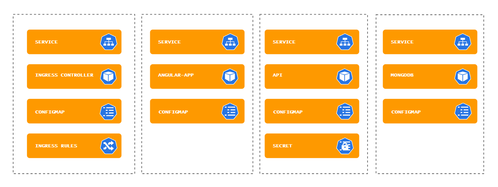

# Kubernetes-on-Azure

Training materiaal voor de Kubernetes on Azure workshop. Deze inhoud is ook beschikbaar in het [Engels / English](README.md)

## Voorbereidingen workshop

Om deze workshop te kunnen volgen, moet je een aantal voorbereidingen treffen. Volg hiervoor de volgende stappen uit de [voorbereiding](workshop/nl/voorbereiding.md). Deelnemers moeten deze stappen doen voor de workshop begint.

## Demo app

Onze demo app "Shakespearean Dating" bestaat uit een Angular 11 Front End, een .NET 5 of Spring Boot API en een MongoDB database.

### Architectuur

In de workshop kan er gekozen worden voor een Spring Boot API of een .NET API (in deze afbeelding zijn ze beide opgenomen). De werking van beide API's is functioneel gelijk.

### Componenten

Tijdens de workshop zul je verschillende Kubernetes componenten uitrollen en zo kennismaken met Kubernetes Resources, YAML, de nodige CLI's en Helm Charts.

### Images

Tijdens de workshop zullen we de images voor de Angular app en de Spring Boot of .NET API zelf bouwen.

## Workshop introductie

Om te ondersteunen bij een korte introductie van de workshop is er een Microsoft PowerPoint slidedeck opgenomen.

## Het Workshop script

Het script begeleidt de deelnemers bij de verschillende stappen van de workshop. Er zijn versies in het [Nederlands](workshop/nl/handson.md) en in het [Engels](workshop/en/handson.md)
