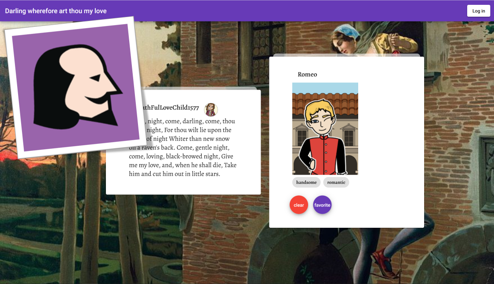
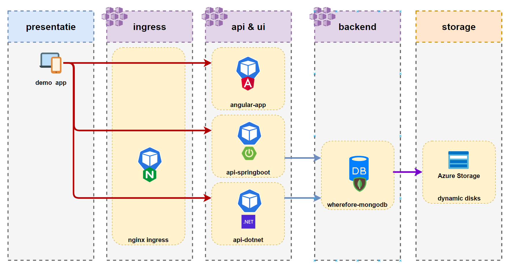
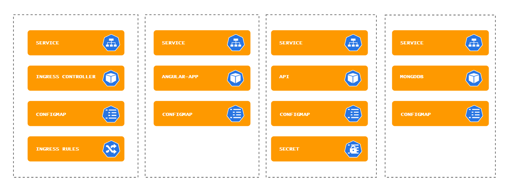
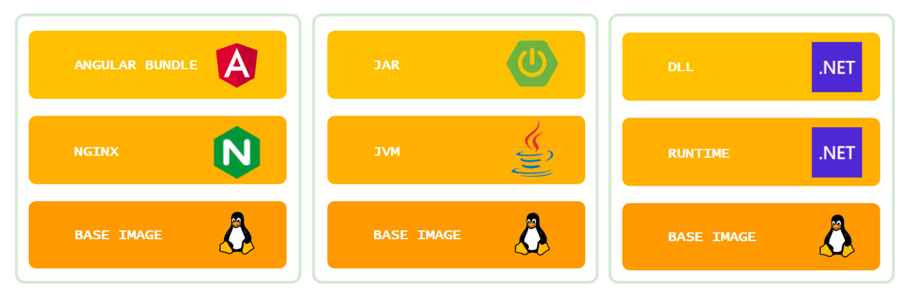

# Kubernetes-on-Azure

Training material for the Kubernetes on Azure workshop. This content is also available in [Dutch / Nederlands](LEESMIJ.md)

## Preparation workshop

To be able to complete the workshop some preparations are needed. Just follow this [preparation guide](workshop/en/preparation.md)

## Demo app

Our demo app "Shakespearean Dating" consists of an Angular 11 Front End, a .NET 5 or Spring Boot API and a MongoDB database.

### Architecture

During the workshop you can choose between a Spring Boot API and a .NET API. Both are shown in this image and are similar in function.

### Components

During the workshop you will provision several Kubernetes components and gain working knowledge on Kubernetes Resources, YAML, the required CLIs and Helm Charts.

### Images

## The Workshop introduction

To assist with the introduction of the workshop a 10-minute introduction Microsoft PowerPoint slidedeck is included.

## The Workshop Script

The workshop script guides the participants through the different steps of the workshop. There are versions in [Dutch](workshop/nl/handson.md) and [English](workshop/en/handson.md).
