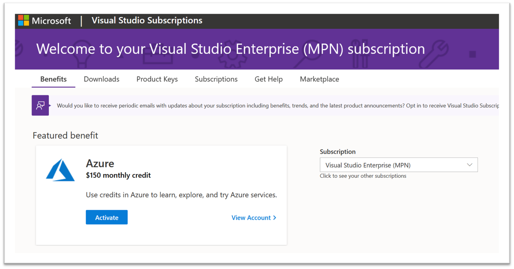
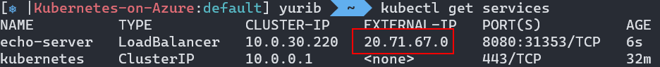
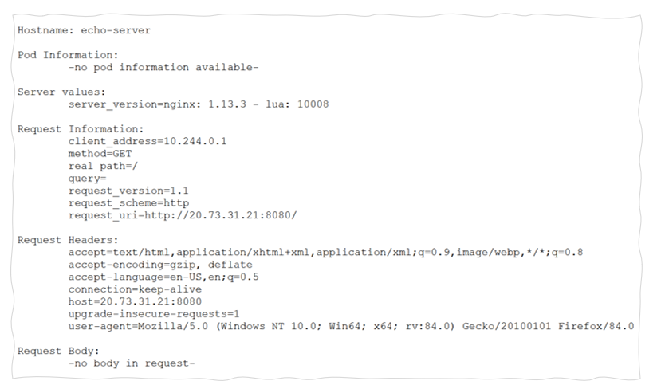

# Voorbereidingen workshop
> Voor alle voorbereidingen en requirements geldt: heb je het al in orde, dan kun je een stap/onderdeel overslaan. Zorg in ieder geval, dat je de smoketest (zie onderaan de pagina) succesvol hebt kunnen afronden.

## Software requirements
We beginnen met een aantal software requirements:
- Git
- Docker Desktop (of zorg zelf voor een alternatief voor de Docker Engine en CLI)
- Inschakelen van Kubernetes lokaal (of zorg zelf voor een alternatief, bijvoorbeeld m.b.v. minikube)
- Azure CLI
- Helm (v3) CLI
- Optioneel: Visual Studio Code (of een alternatieve tekst editor)
- Optioneel: Visual Studio Code plugins
- Optioneel: WSL2 op Windows (optioneel)

Mocht je uit dit lijstje nog wat moeten installeren, dan vind je de beschrijvingen hier: [requirements](requirements.md). Als je alle software geinstalleerd hebt, dan kun je beginnen met de voorbereidingen.

## Een actieve Azure subscriptie met tegoed
We gaan een deployment doen van een Kubernetes cluster op Azure en om dit te kunnen doen, maken we gebruik van onze Microsoft Partner Network licenties. Deze licentie moet je als VX medewerker zelf activeren, waarna je een maandelijks Azure tegoed van 120 Euro kunt "claimen". Dit tegoed is ruim voldoende voor de workshop en hier kun je daarna ook gewoon gebruik van blijven maken. 


1. Navigeer naar https://my.visualstudio.com en log in met je eigen @vxcompany.com account. 
2. Op de landingspagina vind je als het goed is een card met de 120,- euro (of $150,-) Azure tegoed. Klik op de button "Activate" om dit te activeren.
3. Volg de stappen voor het aanmaken van een persoonlijke Azure subscription.
4. Uiteindelijk opent de Azure Portal en heb je een eigen Azure omgeving.

> Meer informatie vind je in de Microsoft documentatie: https://docs.microsoft.com/en-us/visualstudio/subscriptions/vs-azure 


## Een Kubernetes cluster op Azure Kubernetes Services
Je kunt een Kubernetes cluster aanmaken via de UI of via de Azure CLI. In deze handleiding gebruiken we de CLI. Mocht je het via de UI willen doen, dan kun je deze video bekijken [TODO Video volgt].


> Om de volgende stappen te volgen heb je de Azure CLI nodig. Zie https://docs.microsoft.com/en-us/cli/azure/install-azure-cli voor meer informatie.


1. Login op Azure
Gebruik de Azure CLI om in te loggen en gebruik het account (je @vxcompany.com account), dat aan de MPN licentie/subscriptie hangt. Als het is gelukt, retourneert de dit commando 1 of meerdere subscripties.
```
az login
```

2. Selecteer de juiste subscription
Als er meerdere subscripties zijn (bijvoorbeeld van een klant of de VX Factory), dan moet je vaak nog even de juiste selecteren. Je kunt de juiste id (GUID) vinden in de output van het login commando uit stap 1.
```
az account set -s [id van de juiste subscriptie]
```

3. Maak een resource group aan om ons cluster in te plaatsen
```
az group create --name Kubernetes-on-Azure --location westeurope
```

4. Maak een Azure Container Registry aan. De naam moet globaal uniek zijn, geen spaties of streepjes, tussen 5-50 karakters 
```
#geen spaties of streepjes, tussen 5-50 karakters 
MYACR=[naam van de container registry]

az acr create -n $MYACR -g Kubernetes-on-Azure --sku basic
```

5. Maak een Kubernetes cluster aan
```
az aks create -n Kubernetes-on-Azure -g Kubernetes-on-Azure --node-count 1 --generate-ssh-keys --attach-acr $MYACR
```

6. Verbind met het cluster
Om de "kubectl" CLI te verbinden met het Kubernetes cluster kun je het volgende commande gebruiken. Dit commando download de benodigde credentials en configureert de CLI.
```
az aks get-credentials --resource-group Kubernetes-on-Azure --name Kubernetes-on-Azure
```

## Smoketest
1. Login op Azure

Gebruik de Azure CLI om in te loggen en gebruik het account (je @vxcompany.com account), dat aan de MPN licentie/subscriptie hangt. Als het is gelukt, retourneert de dit commando 1 of meerdere subscripties.
```
az login
```

2. Selecteer de juiste subscription

Als er meerdere subscripties zijn (bijvoorbeeld van een klant of de VX Factory), dan moet je vaak nog even de juiste selecteren. Je kunt de juiste id (GUID) vinden in de output van het login commando uit stap 1.
```
az account set -s [id van de juiste subscriptie]
```

3. Verbind met het cluster

Als je al verbonden geweest bent met het cluster hoef je deze stap niet meer te doen. Je kunt evenvoudig de juiste context selecteren.
```
kubectl config use-context Kubernetes-on-Azure 
````

3. Deploy een testpod en service
```
#als het goed is draait er niets
kubectl get pods

#deploy een test server
kubectl run echo-server --port 8080 --image k8s.gcr.io/echoserver:1.10

#deploy een service
kubectl expose pod echo-server --type LoadBalancer --port 8080

````

4. Test verbinding

Als alles goed is gegaan, dan heb je een hello-world pod en service uitgerold op het cluster. Deze kun je testen door met een browser naar het juiste ip-adres te gaan. Welk externe adres dat is, kun je onder andere terugvinden in de output van:
```
kubectl get services
```


Wanneer je nu met een browser navigeert naar: http://[external-ip]:8080 zou de test server moeten antwoorden.



5. Verwijder testpod en service
```
kubectl delete pod echo-server
kubectl delete service echo-server
```

## Tijdelijk uitschakelen om credits te sparen
Als je het cluster "aan laat staan" gaan de kosten van de onderliggende VM's (de Kubernetes nodes) af van het maandelijkse tegoed. Wanneer je de handleiding hebt gevolgd, dan heb je 1 node (type D2) en die kost ongeveer 70 euro per maand. Mocht je het cluster niet gebruiken, dan kun je tijdelijk die nodes stoppen om zo tegoed te besparen. 

[TODO]

Niet vergeten om de scaleset weer te starten als je het cluster gaat gebruiken!